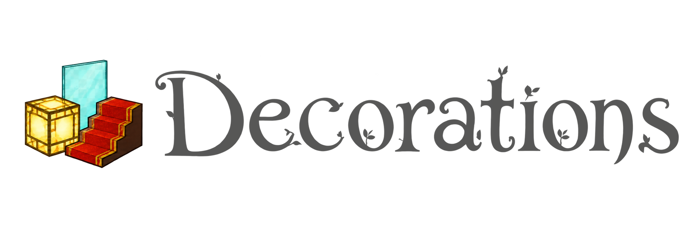

# Growthcraft Decorations

[](https://github.com/GrowthcraftCE/Growthcraft-Deco)
[](https://www.minecraft.net/)
[](https://neoforged.net/)
[](https://www.curseforge.com/minecraft/mc-mods/growthcraft-decorations)
[](https://discord.gg/Quh76Jn)

Growthcraft Decorations expands Minecraft's building palette with decorative variants of vanilla blocks. It includes
light-emitting versions of familiar blocks, new stair and slab shapes, thin panels, carpeted stairs, and disguised doors
that blend into surrounding builds.

The mod is maintained as a standalone Growthcraft project. Growthcraft Community Edition is not required.

## Decorative Blocks

### Glowing Blocks

Glowing variants retain the appearance and general properties of their vanilla counterparts while emitting light.
Variants include solid building blocks, stairs, glass panes, glass panels, and glass slabs in supported materials and
colors.

### Stairs, Slabs, and Panels

Growthcraft Decorations adds shapes that are missing from vanilla's standard block families, including:

- Concrete, terracotta, and wool stairs
- Glass, glowstone, glowshroom, organic, and stone slabs or panels
- Additional glowing stair variants for supported stone families
- Thin glass panels and glowing stained-glass panes

### Carpeted Stairs

Full and partial carpet variants add colored wool coverings to supported stairs. These are useful for seating, trim,
paths, and interior decoration without replacing the underlying stair shape.

### Hidden Doors

Hidden doors use the appearance of supported vanilla blocks so entrances can blend into walls and other structures.
Their registry names are kept stable to preserve compatibility with existing Growthcraft Decorations worlds wherever
the platform permits.

## Support

- Report bugs or request features through [GitHub Issues](https://github.com/GrowthcraftCE/Growthcraft-Deco/issues).
- Join the [Growthcraft Discord](https://discord.gg/Quh76Jn) for discussion and help.
- Download published releases from [CurseForge](https://www.curseforge.com/minecraft/mc-mods/growthcraft-decorations).

When reporting a problem, include the Minecraft, NeoForge, and Growthcraft Decorations versions along with the relevant
`latest.log` or crash report.

## Version History

Growthcraft Decorations versions use the supported Minecraft version followed by the mod release number. For example,
`1.21.1.1` is the first Growthcraft Decorations release targeting Minecraft 1.21.1.

| Minecraft | Loader | Latest Decorations version | Status |
| --- | --- | --- | --- |
| 1.21.1 | NeoForge | 1.21.1.1 | In development |
| 1.21 | Forge | 1.21.0.1 | Released |
| 1.20.6 | Forge | 1.20.6.1 | Released |
| 1.20.4 | Forge | 1.20.4.1 | Released |
| 1.20.3 | Forge | 1.20.3.1 | Released |
| 1.20.2 | Forge | 9.2.0 | Released |
| 1.20.1 | Forge | 9.0.3 | Released |

Older versions remain available from the project's
[CurseForge files](https://www.curseforge.com/minecraft/mc-mods/growthcraft-decorations/files/all) and Git history.

## Contributing and Development

Before starting a change, open or comment on a GitHub issue so work is not duplicated. Keep changes targeted to the
appropriate Minecraft version branch. This repository uses version branches; Minecraft 1.21.1 NeoForge work belongs on
`1.21.1-neo`.

Requirements:

- Java 21
- The included Gradle Wrapper
- A Minecraft 1.21.1-compatible IDE

Useful commands:

```powershell
.\gradlew.bat compileJava
.\gradlew.bat processResources
.\gradlew.bat runClient
.\gradlew.bat runServer
.\gradlew.bat runData
```

This project uses NeoForge ModDev. IntelliJ run configurations are prepared when the Gradle project is reloaded; the
equivalent command-line synchronization task is `neoForgeIdeSync`.

Generated recipes, loot tables, tags, blockstates, models, item models, and translations are stored under
`src/generated/resources`. Run data generation and inspect its diff whenever a provider or registered block changes.

## License

Growthcraft Decorations is licensed under the [GNU General Public License v3.0](LICENSE).
